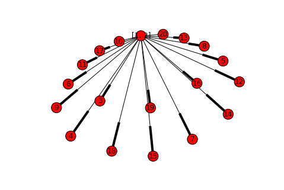

.. code:: python

    from nilmtk.utils import print_dict

Convert data to NILMTK format and load into NILMTK
==================================================

NILMTK uses an open file format based on the HDF5 binary file format to
store both the power data and the metadata. The very first step when
using NILMTK is to convert your dataset to the NILMTK HDF5 file format.

REDD
----

Converting the REDD dataset is easy because NILMTK v0.2 ships with a
``convert_redd`` function:

.. code:: python

    from nilmtk.dataset_converters import convert_redd
    convert_redd('/data/REDD/low_freq', '/data/REDD/redd.h5')

.. parsed-literal::

    Loading house 1... 1 2 3 4 5 6 7 8 9 10 11 12 13 14 15 16 17 18 19 20 
    Loading house 2... 1 2 3 4 5 6 7 8 9 10 11 
    Loading house 3... 1 2 3 4 5 6 7 8 9 10 11 12 13 14 15 16 17 18 19 20 21 22 
    Loading house 4... 1 2 3 4 5 6 7 8 9 10 11 12 13 14 15 16 17 18 19 20 
    Loading house 5... 1 2 3 4 5 6 7 8 9 10 11 12 13 14 15 16 17 18 19 20 21 22 23 24 25 26 
    Loading house 6... 1 2 3 4 5 6 7 8 9 10 11 12 13 14 15 16 17 
    Done converting YAML metadata to HDF5!
    Done converting REDD to HDF5!

Now ``redd.h5`` holds all the REDD power data and all the relevant
metadata. In NILMTK v0.2 this conversion only uses a tiny fraction of
the system memory (unlike NILMTK v0.1 which would guzzle ~1 GByte of RAM
just to do the dataset conversion!).

Of course, if you want to run ``convert_redd`` on your own machine then
you first need to download `REDD <http://redd.csail.mit.edu>`__,
decompress it and pass the relevant ``source_directory`` and
``output_filename`` to ``convert_redd()``.

Other datasets
--------------

At the time of writing, `NILMTK contains converters for 8
datasets <https://github.com/nilmtk/nilmtk/tree/master/nilmtk/dataset_converters>`__.

Contributing a new converter is easy and highly encouraged! `Learn how
to write a dataset converter <writing_a_dataset_converter.html>`__.

Open HDF5 in NILMTK
-------------------

.. code:: python

    from nilmtk import DataSet
    
    redd = DataSet('/data/REDD/redd.h5')

At this point, all the metadata has been loaded into memory but none of
the power data has been loaded. This is our first encounter with a
fundamental difference between NILMTK v0.1 and v0.2: NILMTK v0.1 used to
eagerly load the entire dataset into memory before you did any actual
work on the data. NILMTK v0.2 is lazy! It won't load data into memory
until you tell it what you want to do with the data (and, even then,
large dataset will be loaded in chunks that fit into memory). This
allows NILMTK v0.2 to work with arbitrarily large datasets (datasets too
large to fit into memory) without choking your system.

Exploring the ``DataSet`` object
~~~~~~~~~~~~~~~~~~~~~~~~~~~~~~~~

Let's have a quick poke around to see what's in this ``redd`` object...

There is a lot of metadata associated with the dataset, including
information about the two models of meter device the authors used to
record REDD:

.. code:: python

    print_dict(redd.metadata)

.. raw:: html

    <ul><li><strong>meter_devices</strong>: <ul><li><strong>eMonitor</strong>: <ul><li><strong>max_sample_period</strong>: 50</li><li><strong>description</strong>: Measures circuit-level power demand.  Comes with 24 CTs. This FAQ page suggests the eMonitor measures real (active) power: http://www.energycircle.com/node/14103  although the REDD readme.txt says all channels record apparent power.
    </li><li><strong>manufacturer_url</strong>: http://powerhousedynamics.com</li><li><strong>measurements</strong>: <ul><li>{'type': 'active', 'upper_limit': 5000, 'lower_limit': 0, 'physical_quantity': 'power'}</li></ul></li><li><strong>sample_period</strong>: 3</li><li><strong>wireless</strong>: False</li><li><strong>model</strong>: eMonitor</li><li><strong>manufacturer</strong>: Powerhouse Dynamics</li></ul></li><li><strong>REDD_whole_house</strong>: <ul><li><strong>max_sample_period</strong>: 30</li><li><strong>wireless</strong>: False</li><li><strong>measurements</strong>: <ul><li>{'type': 'apparent', 'upper_limit': 50000, 'lower_limit': 0, 'physical_quantity': 'power'}</li></ul></li><li><strong>description</strong>: </li><li><strong>sample_period</strong>: 1</li></ul></li></ul></li><li><strong>creators</strong>: <ul><li>Kolter, Zico</li><li>Johnson, Matthew</li></ul></li><li><strong>name</strong>: REDD</li><li><strong>description</strong>: Several weeks of power data for 6 different homes.</li><li><strong>number_of_buildings</strong>: 6</li><li><strong>related_documents</strong>: <ul><li>http://redd.csail.mit.edu</li><li>J. Zico Kolter and Matthew J. Johnson. REDD: A public data set for energy disaggregation research. In proceedings of the SustKDD workshop on Data Mining Applications in Sustainability, 2011. http://redd.csail.mit.edu/kolter-kddsust11.pdf
    </li></ul></li><li><strong>long_name</strong>: The Reference Energy Disaggregation Data set</li><li><strong>contact</strong>: zkolter@cs.cmu.edu</li><li><strong>geo_location</strong>: <ul><li><strong>latitude</strong>: 42.360091</li><li><strong>country</strong>: US</li><li><strong>longitude</strong>: -71.09416</li><li><strong>locality</strong>: Massachusetts</li></ul></li><li><strong>publication_date</strong>: 2011</li><li><strong>timezone</strong>: US/Eastern</li><li><strong>schema</strong>: https://github.com/nilmtk/nilm_metadata/tree/v0.2</li><li><strong>institution</strong>: Massachusetts Institute of Technology (MIT)</li><li><strong>subject</strong>: Disaggregated power demand from domestic buildings.</li></ul>

We also have all the buildings available as an
`OrderedDict <https://docs.python.org/2/library/collections.html#collections.OrderedDict>`__
(indexed from 1 not 0 because every dataset we are aware of starts
numbering buildings from 1 not 0)

.. code:: python

    print_dict(redd.buildings)

.. raw:: html

    <ul><li><strong>1</strong>: Building(instance=1, dataset='REDD')</li><li><strong>3</strong>: Building(instance=3, dataset='REDD')</li><li><strong>2</strong>: Building(instance=2, dataset='REDD')</li><li><strong>5</strong>: Building(instance=5, dataset='REDD')</li><li><strong>4</strong>: Building(instance=4, dataset='REDD')</li><li><strong>6</strong>: Building(instance=6, dataset='REDD')</li></ul>

Each building has a little bit of metadata associated with it (there
isn't much building-specific metadata in REDD):

.. code:: python

    print_dict(redd.buildings[1].metadata)

.. raw:: html

    <ul><li><strong>instance</strong>: 1</li><li><strong>dataset</strong>: REDD</li><li><strong>original_name</strong>: house_1</li></ul>

Each building has an ``elec`` attribute which is a ``MeterGroup`` object
(much more about those soon!)

.. code:: python

    redd.buildings[1].elec

.. parsed-literal::

    MeterGroup(meters=
      ElecMeter(instance=1, building=1, dataset='REDD', site_meter, appliances=[])
      ElecMeter(instance=2, building=1, dataset='REDD', site_meter, appliances=[])
      ElecMeter(instance=5, building=1, dataset='REDD', appliances=[Appliance(type='fridge', instance=1)])
      ElecMeter(instance=6, building=1, dataset='REDD', appliances=[Appliance(type='dish washer', instance=1)])
      ElecMeter(instance=7, building=1, dataset='REDD', appliances=[Appliance(type='sockets', instance=1)])
      ElecMeter(instance=8, building=1, dataset='REDD', appliances=[Appliance(type='sockets', instance=2)])
      ElecMeter(instance=9, building=1, dataset='REDD', appliances=[Appliance(type='light', instance=1)])
      ElecMeter(instance=11, building=1, dataset='REDD', appliances=[Appliance(type='microwave', instance=1)])
      ElecMeter(instance=12, building=1, dataset='REDD', appliances=[Appliance(type='unknown', instance=1)])
      ElecMeter(instance=13, building=1, dataset='REDD', appliances=[Appliance(type='electric space heater', instance=1)])
      ElecMeter(instance=14, building=1, dataset='REDD', appliances=[Appliance(type='electric stove', instance=1)])
      ElecMeter(instance=15, building=1, dataset='REDD', appliances=[Appliance(type='sockets', instance=3)])
      ElecMeter(instance=16, building=1, dataset='REDD', appliances=[Appliance(type='sockets', instance=4)])
      ElecMeter(instance=17, building=1, dataset='REDD', appliances=[Appliance(type='light', instance=2)])
      ElecMeter(instance=18, building=1, dataset='REDD', appliances=[Appliance(type='light', instance=3)])
      ElecMeter(instance=19, building=1, dataset='REDD', appliances=[Appliance(type='unknown', instance=2)])
      MeterGroup(meters=
        ElecMeter(instance=3, building=1, dataset='REDD', appliances=[Appliance(type='electric oven', instance=1)])
        ElecMeter(instance=4, building=1, dataset='REDD', appliances=[Appliance(type='electric oven', instance=1)])
      )
      MeterGroup(meters=
        ElecMeter(instance=10, building=1, dataset='REDD', appliances=[Appliance(type='washer dryer', instance=1)])
        ElecMeter(instance=20, building=1, dataset='REDD', appliances=[Appliance(type='washer dryer', instance=1)])
      )
    )

Yup, that's where all the meat lies!

And here's a wiring diagram of the meter hierarchy:

.. code:: python

    redd.buildings[1].elec.draw_wiring_graph()

It isn't very pretty but it shows that all the submeters are immediately
downstream of the two mains meters.

Let's dive in a little deeper and tinker with ``MeterGroup``...

