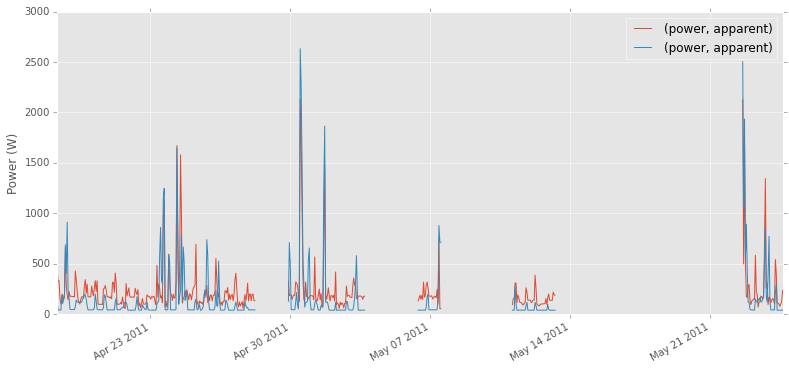
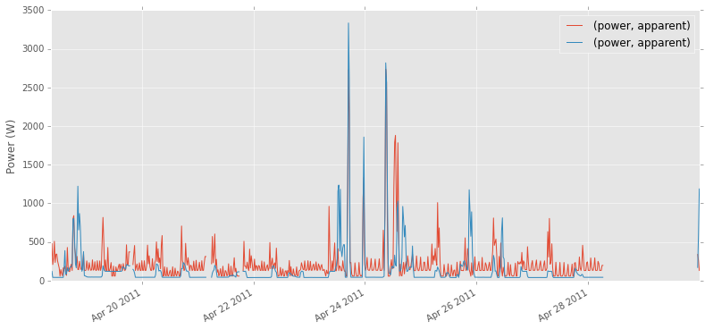
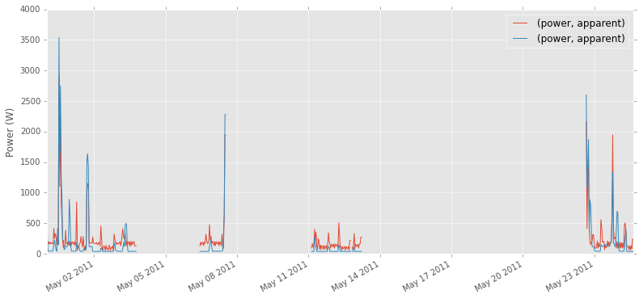
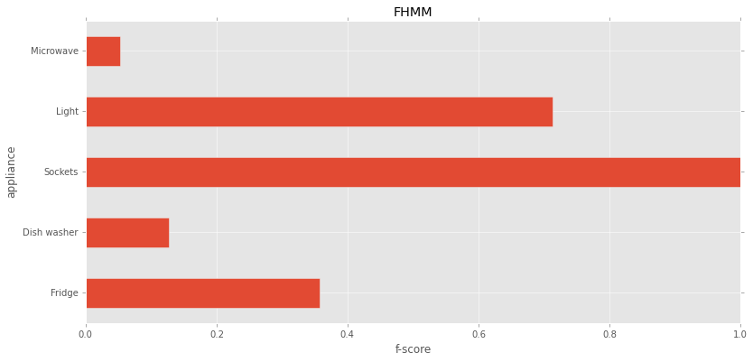
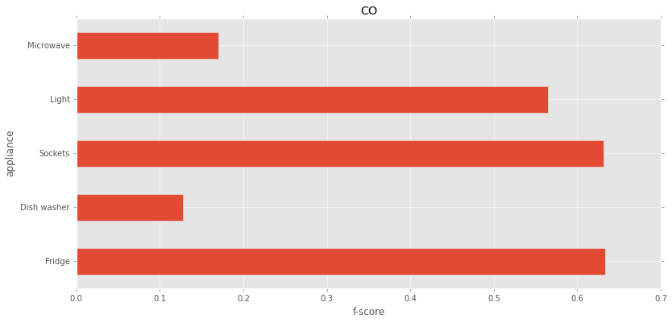

Disaggregation and Metrics
==========================

.. code:: python

    import time
    from matplotlib import rcParams
    import matplotlib.pyplot as plt
    %matplotlib inline
    rcParams['figure.figsize'] = (13, 6)
    plt.style.use('ggplot')
    
    from nilmtk import DataSet, TimeFrame, MeterGroup, HDFDataStore
    from nilmtk.disaggregate import CombinatorialOptimisation

Dividing data into train and test set
~~~~~~~~~~~~~~~~~~~~~~~~~~~~~~~~~~~~~

.. code:: python

    train = DataSet('/data/REDD/redd.h5')
    test = DataSet('/data/REDD/redd.h5')

Let us use building 1 for demo purposes

.. code:: python

    building = 1

.. code:: python

    train.buildings[building].elec.mains().plot()

.. parsed-literal::

    <matplotlib.axes._subplots.AxesSubplot at 0x10aae2e10>

Let's split data at April 30th
~~~~~~~~~~~~~~~~~~~~~~~~~~~~~~

.. code:: python

    train.set_window(end="30-4-2011")
    test.set_window(start="30-4-2011")
    
    
    train_elec = train.buildings[1].elec
    test_elec = test.buildings[1].elec

.. code:: python

    train_elec.mains().plot()

.. parsed-literal::

    <matplotlib.axes._subplots.AxesSubplot at 0x10c4d4a90>

.. code:: python

    test_elec.mains().plot()

.. parsed-literal::

    <matplotlib.axes._subplots.AxesSubplot at 0x10c8f8250>

REDD data set has got appliance level data sampled every 3 or 4 seconds
and mains data sampled every 1 second. Let us verify the same.

To allow disaggregation to be done on any arbitrarily large dataset,
disaggregation output is dumped to disk chunk-by-chunk:

.. code:: python

    fridge_meter = train_elec['fridge']

.. code:: python

    fridge_df = fridge_meter.load().next()

.. code:: python

    fridge_df.head()

.. raw:: html

    

    <table border="1" class="dataframe">
      <thead>
        <tr>
          <th>physical_quantity</th>
          <th>power</th>
        </tr>
        <tr>
          <th>type</th>
          <th>active</th>
        </tr>
      </thead>
      <tbody>
        <tr>
          <th>2011-04-18 09:22:13-04:00</th>
          <td>6</td>
        </tr>
        <tr>
          <th>2011-04-18 09:22:16-04:00</th>
          <td>6</td>
        </tr>
        <tr>
          <th>2011-04-18 09:22:20-04:00</th>
          <td>6</td>
        </tr>
        <tr>
          <th>2011-04-18 09:22:23-04:00</th>
          <td>6</td>
        </tr>
        <tr>
          <th>2011-04-18 09:22:26-04:00</th>
          <td>6</td>
        </tr>
      </tbody>
    </table>
    

.. code:: python

    mains = train_elec.mains()

.. code:: python

    mains_df = mains.load().next()

.. parsed-literal::

    Loading data for meter ElecMeterID(instance=2, building=1, dataset='REDD')     
    Done loading data all meters for this chunk.

.. code:: python

    mains_df.head()

.. raw:: html

    

    <table border="1" class="dataframe">
      <thead>
        <tr>
          <th>physical_quantity</th>
          <th>power</th>
        </tr>
        <tr>
          <th>type</th>
          <th>apparent</th>
        </tr>
      </thead>
      <tbody>
        <tr>
          <th>2011-04-18 09:22:09-04:00</th>
          <td>342.820007</td>
        </tr>
        <tr>
          <th>2011-04-18 09:22:10-04:00</th>
          <td>344.559998</td>
        </tr>
        <tr>
          <th>2011-04-18 09:22:11-04:00</th>
          <td>345.140015</td>
        </tr>
        <tr>
          <th>2011-04-18 09:22:12-04:00</th>
          <td>341.679993</td>
        </tr>
        <tr>
          <th>2011-04-18 09:22:13-04:00</th>
          <td>341.029999</td>
        </tr>
      </tbody>
    </table>
    

Since, both of these are sampled at different frequencies, we will
downsample both to 1 minute resolution. We will also select the top-5
appliances in terms of energy consumption and use them for training our
FHMM and CO models.

Selecting top-5 appliances
~~~~~~~~~~~~~~~~~~~~~~~~~~

.. code:: python

    top_5_train_elec = train_elec.submeters().select_top_k(k=5)

.. parsed-literal::

    15/16 MeterGroup(meters=
      ElecMeter(instance=3, building=1, dataset='REDD', appliances=[Appliance(type='electric oven', instance=1)])
      ElecMeter(instance=4, building=1, dataset='REDD', appliances=[Appliance(type='electric oven', instance=1)])
    16/16 MeterGroup(meters=
      ElecMeter(instance=10, building=1, dataset='REDD', appliances=[Appliance(type='washer dryer', instance=1)])
      ElecMeter(instance=20, building=1, dataset='REDD', appliances=[Appliance(type='washer dryer', instance=1)])
    Calculating total_energy for ElecMeterID(instance=20, building=1, dataset='REDD') ...   

.. code:: python

    top_5_train_elec

.. parsed-literal::

    MeterGroup(meters=
      ElecMeter(instance=5, building=1, dataset='REDD', appliances=[Appliance(type='fridge', instance=1)])
      ElecMeter(instance=11, building=1, dataset='REDD', appliances=[Appliance(type='microwave', instance=1)])
      ElecMeter(instance=8, building=1, dataset='REDD', appliances=[Appliance(type='sockets', instance=2)])
      ElecMeter(instance=9, building=1, dataset='REDD', appliances=[Appliance(type='light', instance=1)])
      ElecMeter(instance=6, building=1, dataset='REDD', appliances=[Appliance(type='dish washer', instance=1)])
    )

Training and disaggregation
~~~~~~~~~~~~~~~~~~~~~~~~~~~

FHMM
^^^^

.. code:: python

    start=time.time()
    from nilmtk.disaggregate import fhmm_exact
    fhmm = fhmm_exact.FHMM()
    # Note that we have given the sample period to downsample the data to 1 minute
    fhmm.train(top_5_train_elec, sample_period=60)
    end=time.time()
    print end-start

.. parsed-literal::

    Training model for submeter 'ElecMeter(instance=5, building=1, dataset='REDD', appliances=[Appliance(type='fridge', instance=1)])'
    Training model for submeter 'ElecMeter(instance=11, building=1, dataset='REDD', appliances=[Appliance(type='microwave', instance=1)])'
    Training model for submeter 'ElecMeter(instance=8, building=1, dataset='REDD', appliances=[Appliance(type='sockets', instance=2)])'
    Training model for submeter 'ElecMeter(instance=9, building=1, dataset='REDD', appliances=[Appliance(type='light', instance=1)])'
    Training model for submeter 'ElecMeter(instance=6, building=1, dataset='REDD', appliances=[Appliance(type='dish washer', instance=1)])'
    12.2300918102

.. code:: python

    disag_filename = '/data/REDD/redd-disag-fhmm.h5'
    output = HDFDataStore(disag_filename, 'w')
    # Note that we have mentioned to disaggregate after converting to a sample period of 60 seconds
    fhmm.disaggregate(test_elec.mains(), output, sample_period=60)
    output.close()

.. parsed-literal::

    Loading data for meter ElecMeterID(instance=2, building=1, dataset='REDD')     
    Done loading data all meters for this chunk.

.. code:: python

    disag_fhmm = DataSet(disag_filename)
    disag_fhmm_elec = disag_fhmm.buildings[building].elec

.. code:: python

    from nilmtk.metrics import f1_score
    f1_fhmm = f1_score(disag_fhmm_elec, test_elec)
    f1_fhmm.index = disag_fhmm_elec.get_labels(f1_fhmm.index)
    f1_fhmm.plot(kind='barh')
    plt.ylabel('appliance');
    plt.xlabel('f-score');
    plt.title("FHMM");

.. code:: python

    start=time.time()
    from nilmtk.disaggregate import CombinatorialOptimisation
    co = CombinatorialOptimisation()
    # Note that we have given the sample period to downsample the data to 1 minute
    co.train(top_5_train_elec, sample_period=60)
    end=time.time()
    print end-start

.. parsed-literal::

    Training model for submeter 'ElecMeter(instance=5, building=1, dataset='REDD', appliances=[Appliance(type='fridge', instance=1)])'
    Training model for submeter 'ElecMeter(instance=11, building=1, dataset='REDD', appliances=[Appliance(type='microwave', instance=1)])'
    Training model for submeter 'ElecMeter(instance=8, building=1, dataset='REDD', appliances=[Appliance(type='sockets', instance=2)])'
    Training model for submeter 'ElecMeter(instance=9, building=1, dataset='REDD', appliances=[Appliance(type='light', instance=1)])'
    Training model for submeter 'ElecMeter(instance=6, building=1, dataset='REDD', appliances=[Appliance(type='dish washer', instance=1)])'
    Done training!
    2.3315141201

.. code:: python

    disag_filename = '/data/REDD/redd-disag-co.h5'
    output = HDFDataStore(disag_filename, 'w')
    # Note that we have mentioned to disaggregate after converting to a sample period of 60 seconds
    co.disaggregate(test_elec.mains(), output, sample_period=60)
    output.close()

.. parsed-literal::

    Loading data for meter ElecMeterID(instance=2, building=1, dataset='REDD')     
    Done loading data all meters for this chunk.
    vampire_power = 90.8099975586 watts
    Loading data for meter ElecMeterID(instance=2, building=1, dataset='REDD')     
    Done loading data all meters for this chunk.
    Estimating power demand for 'ElecMeter(instance=5, building=1, dataset='REDD', appliances=[Appliance(type='fridge', instance=1)])'
    Estimating power demand for 'ElecMeter(instance=11, building=1, dataset='REDD', appliances=[Appliance(type='microwave', instance=1)])'
    Estimating power demand for 'ElecMeter(instance=8, building=1, dataset='REDD', appliances=[Appliance(type='sockets', instance=2)])'
    Estimating power demand for 'ElecMeter(instance=9, building=1, dataset='REDD', appliances=[Appliance(type='light', instance=1)])'
    Estimating power demand for 'ElecMeter(instance=6, building=1, dataset='REDD', appliances=[Appliance(type='dish washer', instance=1)])'
    Loading data for meter ElecMeterID(instance=2, building=1, dataset='REDD')     
    Done loading data all meters for this chunk.
    Estimating power demand for 'ElecMeter(instance=5, building=1, dataset='REDD', appliances=[Appliance(type='fridge', instance=1)])'
    Estimating power demand for 'ElecMeter(instance=11, building=1, dataset='REDD', appliances=[Appliance(type='microwave', instance=1)])'
    Estimating power demand for 'ElecMeter(instance=8, building=1, dataset='REDD', appliances=[Appliance(type='sockets', instance=2)])'
    Estimating power demand for 'ElecMeter(instance=9, building=1, dataset='REDD', appliances=[Appliance(type='light', instance=1)])'
    Estimating power demand for 'ElecMeter(instance=6, building=1, dataset='REDD', appliances=[Appliance(type='dish washer', instance=1)])'
    Loading data for meter ElecMeterID(instance=2, building=1, dataset='REDD')     
    Done loading data all meters for this chunk.
    Estimating power demand for 'ElecMeter(instance=5, building=1, dataset='REDD', appliances=[Appliance(type='fridge', instance=1)])'
    Estimating power demand for 'ElecMeter(instance=11, building=1, dataset='REDD', appliances=[Appliance(type='microwave', instance=1)])'
    Estimating power demand for 'ElecMeter(instance=8, building=1, dataset='REDD', appliances=[Appliance(type='sockets', instance=2)])'
    Estimating power demand for 'ElecMeter(instance=9, building=1, dataset='REDD', appliances=[Appliance(type='light', instance=1)])'
    Estimating power demand for 'ElecMeter(instance=6, building=1, dataset='REDD', appliances=[Appliance(type='dish washer', instance=1)])'
    Loading data for meter ElecMeterID(instance=2, building=1, dataset='REDD')     
    Done loading data all meters for this chunk.
    Loading data for meter ElecMeterID(instance=2, building=1, dataset='REDD')     
    Done loading data all meters for this chunk.
    Estimating power demand for 'ElecMeter(instance=5, building=1, dataset='REDD', appliances=[Appliance(type='fridge', instance=1)])'
    Estimating power demand for 'ElecMeter(instance=11, building=1, dataset='REDD', appliances=[Appliance(type='microwave', instance=1)])'
    Estimating power demand for 'ElecMeter(instance=8, building=1, dataset='REDD', appliances=[Appliance(type='sockets', instance=2)])'
    Estimating power demand for 'ElecMeter(instance=9, building=1, dataset='REDD', appliances=[Appliance(type='light', instance=1)])'
    Estimating power demand for 'ElecMeter(instance=6, building=1, dataset='REDD', appliances=[Appliance(type='dish washer', instance=1)])'
    Loading data for meter ElecMeterID(instance=2, building=1, dataset='REDD')     
    Done loading data all meters for this chunk.
    Loading data for meter ElecMeterID(instance=2, building=1, dataset='REDD')     
    Done loading data all meters for this chunk.
    Estimating power demand for 'ElecMeter(instance=5, building=1, dataset='REDD', appliances=[Appliance(type='fridge', instance=1)])'
    Estimating power demand for 'ElecMeter(instance=11, building=1, dataset='REDD', appliances=[Appliance(type='microwave', instance=1)])'
    Estimating power demand for 'ElecMeter(instance=8, building=1, dataset='REDD', appliances=[Appliance(type='sockets', instance=2)])'
    Estimating power demand for 'ElecMeter(instance=9, building=1, dataset='REDD', appliances=[Appliance(type='light', instance=1)])'
    Estimating power demand for 'ElecMeter(instance=6, building=1, dataset='REDD', appliances=[Appliance(type='dish washer', instance=1)])'
    Loading data for meter ElecMeterID(instance=2, building=1, dataset='REDD')     
    Done loading data all meters for this chunk.
    Estimating power demand for 'ElecMeter(instance=5, building=1, dataset='REDD', appliances=[Appliance(type='fridge', instance=1)])'
    Estimating power demand for 'ElecMeter(instance=11, building=1, dataset='REDD', appliances=[Appliance(type='microwave', instance=1)])'
    Estimating power demand for 'ElecMeter(instance=8, building=1, dataset='REDD', appliances=[Appliance(type='sockets', instance=2)])'
    Estimating power demand for 'ElecMeter(instance=9, building=1, dataset='REDD', appliances=[Appliance(type='light', instance=1)])'
    Estimating power demand for 'ElecMeter(instance=6, building=1, dataset='REDD', appliances=[Appliance(type='dish washer', instance=1)])'
    Loading data for meter ElecMeterID(instance=2, building=1, dataset='REDD')     
    Done loading data all meters for this chunk.
    Estimating power demand for 'ElecMeter(instance=5, building=1, dataset='REDD', appliances=[Appliance(type='fridge', instance=1)])'
    Estimating power demand for 'ElecMeter(instance=11, building=1, dataset='REDD', appliances=[Appliance(type='microwave', instance=1)])'
    Estimating power demand for 'ElecMeter(instance=8, building=1, dataset='REDD', appliances=[Appliance(type='sockets', instance=2)])'
    Estimating power demand for 'ElecMeter(instance=9, building=1, dataset='REDD', appliances=[Appliance(type='light', instance=1)])'
    Estimating power demand for 'ElecMeter(instance=6, building=1, dataset='REDD', appliances=[Appliance(type='dish washer', instance=1)])'
    Loading data for meter ElecMeterID(instance=2, building=1, dataset='REDD')     
    Done loading data all meters for this chunk.
    Estimating power demand for 'ElecMeter(instance=5, building=1, dataset='REDD', appliances=[Appliance(type='fridge', instance=1)])'
    Estimating power demand for 'ElecMeter(instance=11, building=1, dataset='REDD', appliances=[Appliance(type='microwave', instance=1)])'
    Estimating power demand for 'ElecMeter(instance=8, building=1, dataset='REDD', appliances=[Appliance(type='sockets', instance=2)])'
    Estimating power demand for 'ElecMeter(instance=9, building=1, dataset='REDD', appliances=[Appliance(type='light', instance=1)])'
    Estimating power demand for 'ElecMeter(instance=6, building=1, dataset='REDD', appliances=[Appliance(type='dish washer', instance=1)])'
    Loading data for meter ElecMeterID(instance=2, building=1, dataset='REDD')     
    Done loading data all meters for this chunk.
    Estimating power demand for 'ElecMeter(instance=5, building=1, dataset='REDD', appliances=[Appliance(type='fridge', instance=1)])'
    Estimating power demand for 'ElecMeter(instance=11, building=1, dataset='REDD', appliances=[Appliance(type='microwave', instance=1)])'
    Estimating power demand for 'ElecMeter(instance=8, building=1, dataset='REDD', appliances=[Appliance(type='sockets', instance=2)])'
    Estimating power demand for 'ElecMeter(instance=9, building=1, dataset='REDD', appliances=[Appliance(type='light', instance=1)])'
    Estimating power demand for 'ElecMeter(instance=6, building=1, dataset='REDD', appliances=[Appliance(type='dish washer', instance=1)])'
    Loading data for meter ElecMeterID(instance=2, building=1, dataset='REDD')     
    Done loading data all meters for this chunk.
    Estimating power demand for 'ElecMeter(instance=5, building=1, dataset='REDD', appliances=[Appliance(type='fridge', instance=1)])'
    Estimating power demand for 'ElecMeter(instance=11, building=1, dataset='REDD', appliances=[Appliance(type='microwave', instance=1)])'
    Estimating power demand for 'ElecMeter(instance=8, building=1, dataset='REDD', appliances=[Appliance(type='sockets', instance=2)])'
    Estimating power demand for 'ElecMeter(instance=9, building=1, dataset='REDD', appliances=[Appliance(type='light', instance=1)])'
    Estimating power demand for 'ElecMeter(instance=6, building=1, dataset='REDD', appliances=[Appliance(type='dish washer', instance=1)])'
    Loading data for meter ElecMeterID(instance=2, building=1, dataset='REDD')     
    Done loading data all meters for this chunk.

.. code:: python

    disag_co = DataSet(disag_filename)
    disag_co_elec = disag_co.buildings[building].elec

.. code:: python

    from nilmtk.metrics import f1_score
    f1_co= f1_score(disag_co_elec, test_elec)
    f1_co.index = disag_co_elec.get_labels(f1_co.index)
    f1_co.plot(kind='barh')
    plt.ylabel('appliance');
    plt.xlabel('f-score');
    plt.title("CO");

