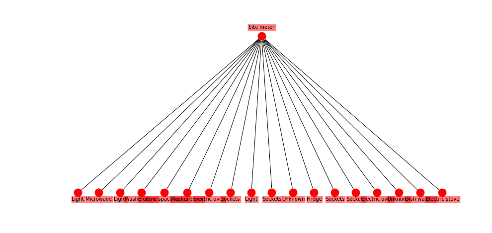
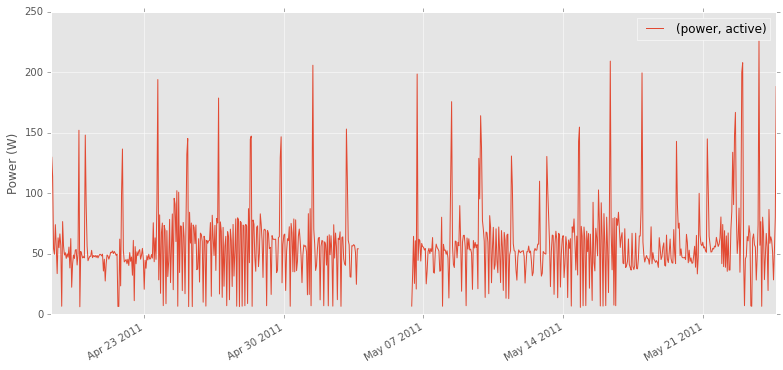
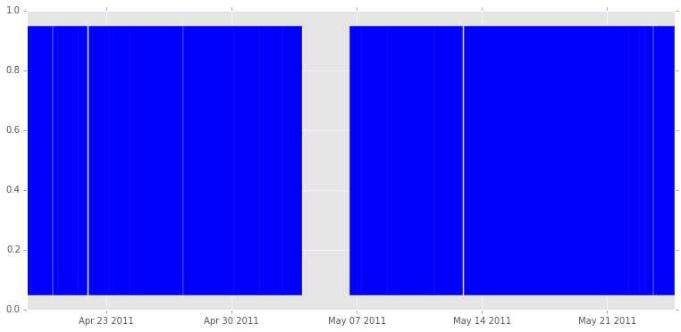

MeterGroup, ElecMeter, selection and basic statistics
=====================================================

All NILM datasets consists of various groupings of electricity meters.
We can group the meters by house. Or by the type of appliance they are
directly connected to. Or by sample rate. Or by whether the meter is a
whole-house "site meter" or an appliance-level submeter, or a
circuit-level submeter.

In NILMTK, one of the key classes is ``MeterGroup`` which stores a list
of ``meters`` and allows us to select a subset of meters, aggregate
power from all meters and many other functions.

When we first open a ``DataSet``, NILMTK creates several ``MeterGroup``
objects. There's ``nilmtk.global_meter_group`` which holds every meter
currently loaded (including from multiple datasets if you have opened
more than one dataset). There is also one ``MeterGroup`` per building
(which live in the ``Building.elec`` attribute). We also nested
``MeterGroups`` for aggregating together split-phase mains, 3-phase
mains and dual-supply (240 volt) appliances in North American and
Canadan datasets. For example, here is the ``MeterGroup`` for building 1
in REDD:

.. code:: python

    from matplotlib import rcParams
    import matplotlib.pyplot as plt
    %matplotlib inline
    rcParams['figure.figsize'] = (13, 6)
    plt.style.use('ggplot')
    from nilmtk import DataSet
    
    
    redd = DataSet('/data/REDD/redd.h5')
    elec = redd.buildings[1].elec
    elec

.. parsed-literal::

    MeterGroup(meters=
      ElecMeter(instance=1, building=1, dataset='REDD', site_meter, appliances=[])
      ElecMeter(instance=2, building=1, dataset='REDD', site_meter, appliances=[])
      ElecMeter(instance=5, building=1, dataset='REDD', appliances=[Appliance(type='fridge', instance=1)])
      ElecMeter(instance=6, building=1, dataset='REDD', appliances=[Appliance(type='dish washer', instance=1)])
      ElecMeter(instance=7, building=1, dataset='REDD', appliances=[Appliance(type='sockets', instance=1)])
      ElecMeter(instance=8, building=1, dataset='REDD', appliances=[Appliance(type='sockets', instance=2)])
      ElecMeter(instance=9, building=1, dataset='REDD', appliances=[Appliance(type='light', instance=1)])
      ElecMeter(instance=11, building=1, dataset='REDD', appliances=[Appliance(type='microwave', instance=1)])
      ElecMeter(instance=12, building=1, dataset='REDD', appliances=[Appliance(type='unknown', instance=1)])
      ElecMeter(instance=13, building=1, dataset='REDD', appliances=[Appliance(type='electric space heater', instance=1)])
      ElecMeter(instance=14, building=1, dataset='REDD', appliances=[Appliance(type='electric stove', instance=1)])
      ElecMeter(instance=15, building=1, dataset='REDD', appliances=[Appliance(type='sockets', instance=3)])
      ElecMeter(instance=16, building=1, dataset='REDD', appliances=[Appliance(type='sockets', instance=4)])
      ElecMeter(instance=17, building=1, dataset='REDD', appliances=[Appliance(type='light', instance=2)])
      ElecMeter(instance=18, building=1, dataset='REDD', appliances=[Appliance(type='light', instance=3)])
      ElecMeter(instance=19, building=1, dataset='REDD', appliances=[Appliance(type='unknown', instance=2)])
      MeterGroup(meters=
        ElecMeter(instance=3, building=1, dataset='REDD', appliances=[Appliance(type='electric oven', instance=1)])
        ElecMeter(instance=4, building=1, dataset='REDD', appliances=[Appliance(type='electric oven', instance=1)])
      )
      MeterGroup(meters=
        ElecMeter(instance=10, building=1, dataset='REDD', appliances=[Appliance(type='washer dryer', instance=1)])
        ElecMeter(instance=20, building=1, dataset='REDD', appliances=[Appliance(type='washer dryer', instance=1)])
      )
    )

Note that there are two nested ``MeterGroups``: one for the electric
oven, and one for the washer dryer (both of which are 240 volt
appliances and have two meters per appliance):

.. code:: python

    elec.nested_metergroups()

.. parsed-literal::

    [MeterGroup(meters=
       ElecMeter(instance=3, building=1, dataset='REDD', appliances=[Appliance(type='electric oven', instance=1)])
       ElecMeter(instance=4, building=1, dataset='REDD', appliances=[Appliance(type='electric oven', instance=1)])
     ), MeterGroup(meters=
       ElecMeter(instance=10, building=1, dataset='REDD', appliances=[Appliance(type='washer dryer', instance=1)])
       ElecMeter(instance=20, building=1, dataset='REDD', appliances=[Appliance(type='washer dryer', instance=1)])
     )]

Putting these meters into a ``MeterGroup`` allows us to easily sum
together the power demand recorded by both meters to get the total power
demand for the entire appliance (but it's also very easy to see the
individual meter power demand too).

We can easily get a MeterGroup of either the submeters or the mains:

.. code:: python

    elec.mains()

.. parsed-literal::

    MeterGroup(meters=
      ElecMeter(instance=1, building=1, dataset='REDD', site_meter, appliances=[])
      ElecMeter(instance=2, building=1, dataset='REDD', site_meter, appliances=[])
    )

We can easily get the power data for both mains meters summed together:

.. code:: python

    elec.mains().power_series_all_data().head()

.. parsed-literal::

    Loading data for meter ElecMeterID(instance=2, building=1, dataset='REDD')     
    Done loading data all meters for this chunk.

.. parsed-literal::

    2011-04-18 09:22:09-04:00    342.820007
    2011-04-18 09:22:10-04:00    344.559998
    2011-04-18 09:22:11-04:00    345.140015
    2011-04-18 09:22:12-04:00    341.679993
    2011-04-18 09:22:13-04:00    341.029999
    Name: (power, apparent), dtype: float64

.. code:: python

    elec.submeters()

.. parsed-literal::

    MeterGroup(meters=
      ElecMeter(instance=5, building=1, dataset='REDD', appliances=[Appliance(type='fridge', instance=1)])
      ElecMeter(instance=6, building=1, dataset='REDD', appliances=[Appliance(type='dish washer', instance=1)])
      ElecMeter(instance=7, building=1, dataset='REDD', appliances=[Appliance(type='sockets', instance=1)])
      ElecMeter(instance=8, building=1, dataset='REDD', appliances=[Appliance(type='sockets', instance=2)])
      ElecMeter(instance=9, building=1, dataset='REDD', appliances=[Appliance(type='light', instance=1)])
      ElecMeter(instance=11, building=1, dataset='REDD', appliances=[Appliance(type='microwave', instance=1)])
      ElecMeter(instance=12, building=1, dataset='REDD', appliances=[Appliance(type='unknown', instance=1)])
      ElecMeter(instance=13, building=1, dataset='REDD', appliances=[Appliance(type='electric space heater', instance=1)])
      ElecMeter(instance=14, building=1, dataset='REDD', appliances=[Appliance(type='electric stove', instance=1)])
      ElecMeter(instance=15, building=1, dataset='REDD', appliances=[Appliance(type='sockets', instance=3)])
      ElecMeter(instance=16, building=1, dataset='REDD', appliances=[Appliance(type='sockets', instance=4)])
      ElecMeter(instance=17, building=1, dataset='REDD', appliances=[Appliance(type='light', instance=2)])
      ElecMeter(instance=18, building=1, dataset='REDD', appliances=[Appliance(type='light', instance=3)])
      ElecMeter(instance=19, building=1, dataset='REDD', appliances=[Appliance(type='unknown', instance=2)])
      MeterGroup(meters=
        ElecMeter(instance=3, building=1, dataset='REDD', appliances=[Appliance(type='electric oven', instance=1)])
        ElecMeter(instance=4, building=1, dataset='REDD', appliances=[Appliance(type='electric oven', instance=1)])
      )
      MeterGroup(meters=
        ElecMeter(instance=10, building=1, dataset='REDD', appliances=[Appliance(type='washer dryer', instance=1)])
        ElecMeter(instance=20, building=1, dataset='REDD', appliances=[Appliance(type='washer dryer', instance=1)])
      )
    )

Stats for MeterGroups
---------------------

Proportion of energy submetered
~~~~~~~~~~~~~~~~~~~~~~~~~~~~~~~

Let's work out the proportion of energy submetered in REDD building 1:

.. code:: python

    elec.proportion_of_energy_submetered()

.. parsed-literal::

    Running MeterGroup.proportion_of_energy_submetered...
    Calculating total_energy for ElecMeterID(instance=2, building=1, dataset='REDD') ...   

.. parsed-literal::

    /Users/nipunbatra/git/nilmtk/nilmtk/metergroup.py:887: UserWarning: As a quick implementation we only get Good Sections from the first meter in the meter group.  We should really return the intersection of the good sections for all meters.  This will be fixed...
      warn("As a quick implementation we only get Good Sections from"
    /Users/nipunbatra/git/nilmtk/nilmtk/electric.py:303: UserWarning: No shared AC types.  Using 'active' for submeter and 'apparent' for other.
      " and '{:s}' for other.".format(ac_type, other_ac_type))

.. parsed-literal::

    Calculating total_energy for ElecMeterID(instance=2, building=1, dataset='REDD') ...   

.. parsed-literal::

    0.75990318508883437

Note that NILMTK has raised a warning that Mains uses a different type
of power measurement than all the submeters, so it's not an entirely
accurate comparison. Which raises the question: which type of power
measurements are used for the mains and submeters? Let's find out...

Active, apparent and reactive power
~~~~~~~~~~~~~~~~~~~~~~~~~~~~~~~~~~~

.. code:: python

    mains = elec.mains()

.. code:: python

    mains.available_power_ac_types()

.. parsed-literal::

    ['apparent']

.. code:: python

    elec.submeters().available_power_ac_types()

.. parsed-literal::

    ['active']

.. code:: python

    elec.load()

Total Energy
~~~~~~~~~~~~

.. code:: python

    elec.mains().total_energy() # returns kWh

.. parsed-literal::

    Calculating total_energy for ElecMeterID(instance=2, building=1, dataset='REDD') ...   

.. parsed-literal::

    apparent    167.766283
    dtype: float64

Energy per submeter
~~~~~~~~~~~~~~~~~~~

.. code:: python

    energy_per_meter = elec.submeters().energy_per_meter() # kWh, again
    energy_per_meter

.. parsed-literal::

    15/16 MeterGroup(meters=
      ElecMeter(instance=3, building=1, dataset='REDD', appliances=[Appliance(type='electric oven', instance=1)])
      ElecMeter(instance=4, building=1, dataset='REDD', appliances=[Appliance(type='electric oven', instance=1)])
    16/16 MeterGroup(meters=
      ElecMeter(instance=10, building=1, dataset='REDD', appliances=[Appliance(type='washer dryer', instance=1)])
      ElecMeter(instance=20, building=1, dataset='REDD', appliances=[Appliance(type='washer dryer', instance=1)])
    Calculating total_energy for ElecMeterID(instance=20, building=1, dataset='REDD') ...   

.. raw:: html

    

    <table border="1" class="dataframe">
      <thead>
        <tr style="text-align: right;">
          <th></th>
          <th>(5, 1, REDD)</th>
          <th>(6, 1, REDD)</th>
          <th>(7, 1, REDD)</th>
          <th>(8, 1, REDD)</th>
          <th>(9, 1, REDD)</th>
          <th>(11, 1, REDD)</th>
          <th>(12, 1, REDD)</th>
          <th>(13, 1, REDD)</th>
          <th>(14, 1, REDD)</th>
          <th>(15, 1, REDD)</th>
          <th>(16, 1, REDD)</th>
          <th>(17, 1, REDD)</th>
          <th>(18, 1, REDD)</th>
          <th>(19, 1, REDD)</th>
          <th>(((3, 1, REDD), (4, 1, REDD)),)</th>
          <th>(((10, 1, REDD), (20, 1, REDD)),)</th>
        </tr>
      </thead>
      <tbody>
        <tr>
          <th>active</th>
          <td>44.750925</td>
          <td>19.920875</td>
          <td>16.786282</td>
          <td>22.939649</td>
          <td>30.734511</td>
          <td>16.890262</td>
          <td>5.221226</td>
          <td>0.096302</td>
          <td>0.411592</td>
          <td>4.507334</td>
          <td>2.256583</td>
          <td>18.288595</td>
          <td>11.811224</td>
          <td>0.000085</td>
          <td>8.81796</td>
          <td>32.614809</td>
        </tr>
        <tr>
          <th>apparent</th>
          <td>NaN</td>
          <td>NaN</td>
          <td>NaN</td>
          <td>NaN</td>
          <td>NaN</td>
          <td>NaN</td>
          <td>NaN</td>
          <td>NaN</td>
          <td>NaN</td>
          <td>NaN</td>
          <td>NaN</td>
          <td>NaN</td>
          <td>NaN</td>
          <td>NaN</td>
          <td>NaN</td>
          <td>NaN</td>
        </tr>
        <tr>
          <th>reactive</th>
          <td>NaN</td>
          <td>NaN</td>
          <td>NaN</td>
          <td>NaN</td>
          <td>NaN</td>
          <td>NaN</td>
          <td>NaN</td>
          <td>NaN</td>
          <td>NaN</td>
          <td>NaN</td>
          <td>NaN</td>
          <td>NaN</td>
          <td>NaN</td>
          <td>NaN</td>
          <td>NaN</td>
          <td>NaN</td>
        </tr>
      </tbody>
    </table>
    

column headings are the ElecMeter instance numbers.

The function ``fraction_per_meter`` does the same thing as
``energy_per_submeter`` but returns the fraction of energy per meter.

Select meters on the basis of their energy consumption
~~~~~~~~~~~~~~~~~~~~~~~~~~~~~~~~~~~~~~~~~~~~~~~~~~~~~~

Let's make a new MeterGroup which only contains the ElecMeters which
used more than 20 kWh:

.. code:: python

    # energy_per_meter is a DataFrame where each row is a 
    # power type ('active', 'reactive' or 'apparent').
    # All appliance meters in REDD are record 'active' so just select
    # the 'active' row:
    energy_per_meter = energy_per_meter.loc['active']
    more_than_20 = energy_per_meter[energy_per_meter > 20]
    more_than_20

.. parsed-literal::

    (5, 1, REDD)                         44.750925
    (8, 1, REDD)                         22.939649
    (9, 1, REDD)                         30.734511
    (((10, 1, REDD), (20, 1, REDD)),)    32.614809
    Name: active, dtype: float64

.. code:: python

    instances = more_than_20.index
    instances

.. parsed-literal::

    Index([                        (5, 1, u'REDD'),
                                   (8, 1, u'REDD'),
                                   (9, 1, u'REDD'),
           (((10, 1, u'REDD'), (20, 1, u'REDD')),)],
          dtype='object')

Draw wiring diagram
~~~~~~~~~~~~~~~~~~~

We can get the wiring diagram for the MeterGroup:

.. code:: python

    elec.draw_wiring_graph()

.. parsed-literal::

    (<networkx.classes.digraph.DiGraph at 0x10a021c90>,
     <matplotlib.axes._axes.Axes at 0x10a038950>)

It's not very pretty but it shows that meters (1,2) (the site meters)
are upstream of all other meters.

Buildings in REDD have only two levels in their meter hierarchy (mains
and submeters). If there were more than two levels then it might be
useful to get only the meters immediately downstream of mains:

.. code:: python

    elec.meters_directly_downstream_of_mains()

.. parsed-literal::

    MeterGroup(meters=
      ElecMeter(instance=18, building=1, dataset='REDD', appliances=[Appliance(type='light', instance=3)])
      ElecMeter(instance=11, building=1, dataset='REDD', appliances=[Appliance(type='microwave', instance=1)])
      ElecMeter(instance=17, building=1, dataset='REDD', appliances=[Appliance(type='light', instance=2)])
      ElecMeter(instance=20, building=1, dataset='REDD', appliances=[Appliance(type='washer dryer', instance=1)])
      ElecMeter(instance=13, building=1, dataset='REDD', appliances=[Appliance(type='electric space heater', instance=1)])
      ElecMeter(instance=10, building=1, dataset='REDD', appliances=[Appliance(type='washer dryer', instance=1)])
      ElecMeter(instance=3, building=1, dataset='REDD', appliances=[Appliance(type='electric oven', instance=1)])
      ElecMeter(instance=16, building=1, dataset='REDD', appliances=[Appliance(type='sockets', instance=4)])
      ElecMeter(instance=9, building=1, dataset='REDD', appliances=[Appliance(type='light', instance=1)])
      ElecMeter(instance=15, building=1, dataset='REDD', appliances=[Appliance(type='sockets', instance=3)])
      ElecMeter(instance=12, building=1, dataset='REDD', appliances=[Appliance(type='unknown', instance=1)])
      ElecMeter(instance=5, building=1, dataset='REDD', appliances=[Appliance(type='fridge', instance=1)])
      ElecMeter(instance=8, building=1, dataset='REDD', appliances=[Appliance(type='sockets', instance=2)])
      ElecMeter(instance=14, building=1, dataset='REDD', appliances=[Appliance(type='electric stove', instance=1)])
      ElecMeter(instance=7, building=1, dataset='REDD', appliances=[Appliance(type='sockets', instance=1)])
      ElecMeter(instance=4, building=1, dataset='REDD', appliances=[Appliance(type='electric oven', instance=1)])
      ElecMeter(instance=19, building=1, dataset='REDD', appliances=[Appliance(type='unknown', instance=2)])
      ElecMeter(instance=6, building=1, dataset='REDD', appliances=[Appliance(type='dish washer', instance=1)])
    )

Stats and info for individual meters
------------------------------------

The ``ElecMeter`` class represents a single electricity meter. Each
``ElecMeter`` has a list of associated ``Appliance`` objects.
``ElecMeter`` has many of the same stats methods as ``MeterGroup`` such
as ``total_energy`` and ``available_power_ac_types`` and
``power_series`` and ``power_series_all_data``. We will now explore some
more stats functions (many of which are also available on
``MeterGroup``)...

.. code:: python

    fridge_meter = elec['fridge']

Get upstream meter
~~~~~~~~~~~~~~~~~~

.. code:: python

    fridge_meter.upstream_meter() # happens to be the mains meter group!

.. parsed-literal::

    MeterGroup(meters=
      ElecMeter(instance=1, building=1, dataset='REDD', site_meter, appliances=[])
      ElecMeter(instance=2, building=1, dataset='REDD', site_meter, appliances=[])
    )

Metadata about the class of meter
~~~~~~~~~~~~~~~~~~~~~~~~~~~~~~~~~

.. code:: python

    fridge_meter.device

.. parsed-literal::

    {'description': 'Measures circuit-level power demand.  Comes with 24 CTs. This FAQ page suggests the eMonitor measures real (active) power: http://www.energycircle.com/node/14103  although the REDD readme.txt says all channels record apparent power.\n',
     'manufacturer': 'Powerhouse Dynamics',
     'manufacturer_url': 'http://powerhousedynamics.com',
     'max_sample_period': 50,
     'measurements': [{'lower_limit': 0,
       'physical_quantity': 'power',
       'type': 'active',
       'upper_limit': 5000}],
     'model': 'eMonitor',
     'sample_period': 3,
     'wireless': False}

Dominant appliance
~~~~~~~~~~~~~~~~~~

If the metadata specifies that a meter has multiple meters connected to
it then one of those can be specified as the 'dominant' appliance, and
this appliance can be retrieved with this method:

.. code:: python

    fridge_meter.dominant_appliance()

.. parsed-literal::

    Appliance(type='fridge', instance=1)

Total energy
~~~~~~~~~~~~

.. code:: python

    fridge_meter.total_energy() # kWh

.. parsed-literal::

    active    44.750925
    dtype: float64

Get good sections
~~~~~~~~~~~~~~~~~

If we plot the raw power data then we see there is one large gap where,
supposedly, the metering system was not working. (if we were to zoom in
then we'd see lots of smaller gaps too):

.. code:: python

    fridge_meter.plot()

.. parsed-literal::

    <matplotlib.axes._subplots.AxesSubplot at 0x10c68ba10>

We can automatically identify the 'good sections' (i.e. the sections
where every pair of consecutive samples is less than
``max_sample_period`` specified in the dataset metadata):

.. code:: python

    good_sections = fridge_meter.good_sections(full_results=True)
    # specifying full_results=False would give us a simple list of 
    # TimeFrames.  But we want the full GoodSectionsResults object so we can
    # plot the good sections...

.. code:: python

    good_sections.plot()

.. parsed-literal::

    <matplotlib.axes._subplots.AxesSubplot at 0x10c6c5610>

The blue chunks show where the data is good. The white gap is the large
gap seen in the raw power data. There are lots of smaller gaps that we
cannot see at this zoom level.

We can also see the exact sections identified:

.. code:: python

    good_sections.combined()

.. parsed-literal::

    [TimeFrame(start='2011-04-18 09:22:13-04:00', end='2011-04-18 14:00:33-04:00', empty=False),
     TimeFrame(start='2011-04-18 14:03:11-04:00', end='2011-04-19 18:45:09-04:00', empty=False),
     TimeFrame(start='2011-04-19 20:20:05-04:00', end='2011-04-20 01:54:26-04:00', empty=False),
     TimeFrame(start='2011-04-20 01:55:33-04:00', end='2011-04-21 06:14:43-04:00', empty=False),
     TimeFrame(start='2011-04-21 06:17:22-04:00', end='2011-04-21 17:45:02-04:00', empty=False),
     TimeFrame(start='2011-04-21 19:41:23-04:00', end='2011-04-22 22:46:53-04:00', empty=False),
     TimeFrame(start='2011-04-22 22:48:31-04:00', end='2011-04-24 03:48:44-04:00', empty=False),
     TimeFrame(start='2011-04-24 03:52:28-04:00', end='2011-04-27 02:50:14-04:00', empty=False),
     TimeFrame(start='2011-04-27 02:51:25-04:00', end='2011-04-27 03:17:31-04:00', empty=False),
     TimeFrame(start='2011-04-27 03:21:19-04:00', end='2011-04-29 23:07:52-04:00', empty=False),
     TimeFrame(start='2011-04-29 23:10:38-04:00', end='2011-05-01 09:44:36-04:00', empty=False),
     TimeFrame(start='2011-05-01 09:47:22-04:00', end='2011-05-02 17:04:54-04:00', empty=False),
     TimeFrame(start='2011-05-02 17:07:31-04:00', end='2011-05-03 17:30:12-04:00', empty=False),
     TimeFrame(start='2011-05-03 17:32:53-04:00', end='2011-05-03 17:33:17-04:00', empty=False),
     TimeFrame(start='2011-05-06 10:51:50-04:00', end='2011-05-07 02:38:12-04:00', empty=False),
     TimeFrame(start='2011-05-07 02:40:47-04:00', end='2011-05-08 13:32:42-04:00', empty=False),
     TimeFrame(start='2011-05-08 13:33:34-04:00', end='2011-05-11 03:16:14-04:00', empty=False),
     TimeFrame(start='2011-05-11 03:19:47-04:00', end='2011-05-12 17:48:31-04:00', empty=False),
     TimeFrame(start='2011-05-12 20:14:27-04:00', end='2011-05-22 01:00:03-04:00', empty=False),
     TimeFrame(start='2011-05-22 01:01:01-04:00', end='2011-05-22 16:03:54-04:00', empty=False),
     TimeFrame(start='2011-05-22 16:04:50-04:00', end='2011-05-22 23:38:54-04:00', empty=False),
     TimeFrame(start='2011-05-22 23:41:39-04:00', end='2011-05-23 09:22:00-04:00', empty=False),
     TimeFrame(start='2011-05-23 10:31:31-04:00', end='2011-05-24 14:32:01-04:00', empty=False),
     TimeFrame(start='2011-05-24 15:55:38-04:00', end='2011-05-24 15:56:34-04:00', empty=False)]

Dropout rate
~~~~~~~~~~~~

As well as large gaps appearing because the entire system is down, we
also get frequent small gaps from wireless sensors dropping data. This
is sometimes called 'dropout'. The dropout rate is a number between 0
and 1 which specifies the proportion of missing samples. A dropout rate
of 0 means no samples are missing. A value of 1 would mean all samples
are missing:

.. code:: python

    fridge_meter.dropout_rate()

.. parsed-literal::

    0.21922786156570626

Note that the dropout rate has gone down (which is good!) now that we
are ignoring the gaps. This value is probably more representative of the
performance of the wireless system.

Select subgroups of meters
--------------------------

We use ``ElecMeter.select_using_appliances()`` to select a new
MeterGroup using an metadata field. For example, to get all the washer
dryers in the whole of the REDD dataset:

.. code:: python

    import nilmtk
    nilmtk.global_meter_group.select_using_appliances(type='washer dryer')

.. parsed-literal::

    MeterGroup(meters=
      ElecMeter(instance=10, building=1, dataset='REDD', appliances=[Appliance(type='washer dryer', instance=1)])
      ElecMeter(instance=20, building=1, dataset='REDD', appliances=[Appliance(type='washer dryer', instance=1)])
      ElecMeter(instance=7, building=2, dataset='REDD', appliances=[Appliance(type='washer dryer', instance=1)])
      ElecMeter(instance=13, building=3, dataset='REDD', appliances=[Appliance(type='washer dryer', instance=1)])
      ElecMeter(instance=14, building=3, dataset='REDD', appliances=[Appliance(type='washer dryer', instance=1)])
      ElecMeter(instance=7, building=4, dataset='REDD', appliances=[Appliance(type='washer dryer', instance=1)])
      ElecMeter(instance=8, building=5, dataset='REDD', appliances=[Appliance(type='washer dryer', instance=1)])
      ElecMeter(instance=9, building=5, dataset='REDD', appliances=[Appliance(type='washer dryer', instance=1)])
      ElecMeter(instance=4, building=6, dataset='REDD', appliances=[Appliance(type='washer dryer', instance=1)])
    )

Or all appliances in the 'heating' category:

.. code:: python

    nilmtk.global_meter_group.select_using_appliances(category='heating')

.. parsed-literal::

    MeterGroup(meters=
      ElecMeter(instance=13, building=1, dataset='REDD', appliances=[Appliance(type='electric space heater', instance=1)])
      ElecMeter(instance=10, building=3, dataset='REDD', appliances=[Appliance(type='electric furnace', instance=1)])
      ElecMeter(instance=4, building=4, dataset='REDD', appliances=[Appliance(type='electric furnace', instance=1)])
      ElecMeter(instance=6, building=5, dataset='REDD', appliances=[Appliance(type='electric furnace', instance=1)])
      ElecMeter(instance=12, building=5, dataset='REDD', appliances=[Appliance(type='electric space heater', instance=1)])
      ElecMeter(instance=13, building=5, dataset='REDD', appliances=[Appliance(type='electric space heater', instance=1)])
      ElecMeter(instance=12, building=6, dataset='REDD', appliances=[Appliance(type='electric space heater', instance=1)])
    )

Or all appliances in building 1 with a single-phase induction motor(!):

.. code:: python

    nilmtk.global_meter_group.select_using_appliances(building=1, category='single-phase induction motor')

.. parsed-literal::

    MeterGroup(meters=
      ElecMeter(instance=5, building=1, dataset='REDD', appliances=[Appliance(type='fridge', instance=1)])
      ElecMeter(instance=6, building=1, dataset='REDD', appliances=[Appliance(type='dish washer', instance=1)])
      ElecMeter(instance=10, building=1, dataset='REDD', appliances=[Appliance(type='washer dryer', instance=1)])
      ElecMeter(instance=20, building=1, dataset='REDD', appliances=[Appliance(type='washer dryer', instance=1)])
    )

(NILMTK imports the 'common metadata' from the NILM Metadata project,
which includes a wide range of different `category
taxonomies <http://nilm-metadata.readthedocs.org/en/latest/central_metadata.html#appliancetype>`__)

.. code:: python

    nilmtk.global_meter_group.select_using_appliances(building=2, category='laundry appliances')

.. parsed-literal::

    MeterGroup(meters=
      ElecMeter(instance=7, building=2, dataset='REDD', appliances=[Appliance(type='washer dryer', instance=1)])
      ElecMeter(instance=10, building=2, dataset='REDD', appliances=[Appliance(type='dish washer', instance=1)])
      ElecMeter(instance=11, building=2, dataset='REDD', appliances=[Appliance(type='waste disposal unit', instance=1)])
    )

Select a group of meters from properties of the meters (not the appliances)
~~~~~~~~~~~~~~~~~~~~~~~~~~~~~~~~~~~~~~~~~~~~~~~~~~~~~~~~~~~~~~~~~~~~~~~~~~~

.. code:: python

    elec.select(device_model='REDD_whole_house')

.. parsed-literal::

    MeterGroup(meters=
      ElecMeter(instance=1, building=1, dataset='REDD', site_meter, appliances=[])
      ElecMeter(instance=2, building=1, dataset='REDD', site_meter, appliances=[])
    )

.. code:: python

    elec.select(sample_period=3)

.. parsed-literal::

    MeterGroup(meters=
      ElecMeter(instance=5, building=1, dataset='REDD', appliances=[Appliance(type='fridge', instance=1)])
      ElecMeter(instance=6, building=1, dataset='REDD', appliances=[Appliance(type='dish washer', instance=1)])
      ElecMeter(instance=7, building=1, dataset='REDD', appliances=[Appliance(type='sockets', instance=1)])
      ElecMeter(instance=8, building=1, dataset='REDD', appliances=[Appliance(type='sockets', instance=2)])
      ElecMeter(instance=9, building=1, dataset='REDD', appliances=[Appliance(type='light', instance=1)])
      ElecMeter(instance=11, building=1, dataset='REDD', appliances=[Appliance(type='microwave', instance=1)])
      ElecMeter(instance=12, building=1, dataset='REDD', appliances=[Appliance(type='unknown', instance=1)])
      ElecMeter(instance=13, building=1, dataset='REDD', appliances=[Appliance(type='electric space heater', instance=1)])
      ElecMeter(instance=14, building=1, dataset='REDD', appliances=[Appliance(type='electric stove', instance=1)])
      ElecMeter(instance=15, building=1, dataset='REDD', appliances=[Appliance(type='sockets', instance=3)])
      ElecMeter(instance=16, building=1, dataset='REDD', appliances=[Appliance(type='sockets', instance=4)])
      ElecMeter(instance=17, building=1, dataset='REDD', appliances=[Appliance(type='light', instance=2)])
      ElecMeter(instance=18, building=1, dataset='REDD', appliances=[Appliance(type='light', instance=3)])
      ElecMeter(instance=19, building=1, dataset='REDD', appliances=[Appliance(type='unknown', instance=2)])
      MeterGroup(meters=
        ElecMeter(instance=3, building=1, dataset='REDD', appliances=[Appliance(type='electric oven', instance=1)])
        ElecMeter(instance=4, building=1, dataset='REDD', appliances=[Appliance(type='electric oven', instance=1)])
      )
      MeterGroup(meters=
        ElecMeter(instance=10, building=1, dataset='REDD', appliances=[Appliance(type='washer dryer', instance=1)])
        ElecMeter(instance=20, building=1, dataset='REDD', appliances=[Appliance(type='washer dryer', instance=1)])
      )
    )

Select a single meter from a MeterGroup
---------------------------------------

We use ``[]`` to retrive a single ``ElecMeter`` from a ``MeterGroup``.

Search for a meter using appliances connected to each meter
~~~~~~~~~~~~~~~~~~~~~~~~~~~~~~~~~~~~~~~~~~~~~~~~~~~~~~~~~~~

.. code:: python

    elec['fridge']

.. parsed-literal::

    ElecMeter(instance=5, building=1, dataset='REDD', appliances=[Appliance(type='fridge', instance=1)])

Appliances are uniquely identified within a building by a ``type``
(fridge, kettle, television, etc.) and an ``instance`` number. If we do
not specify an instance number then ``ElecMeter`` retrieves instance 1
(instance numbering starts from 1). If you want a different instance
then just do this:

.. code:: python

    elec['light', 2]

.. parsed-literal::

    ElecMeter(instance=17, building=1, dataset='REDD', appliances=[Appliance(type='light', instance=2)])

To uniquely identify an appliance in ``nilmtk.global_meter_group`` then
we must specify the dataset name, building instance number, appliance
type and appliance instance in a dict:

.. code:: python

    import nilmtk
    nilmtk.global_meter_group[{'dataset': 'REDD', 'building': 1, 'type': 'fridge', 'instance': 1}]

.. parsed-literal::

    ElecMeter(instance=5, building=1, dataset='REDD', appliances=[Appliance(type='fridge', instance=1)])

Search for a meter using details of the ElecMeter
~~~~~~~~~~~~~~~~~~~~~~~~~~~~~~~~~~~~~~~~~~~~~~~~~

get ElecMeter with instance = 1:

.. code:: python

    elec[1]

.. parsed-literal::

    ElecMeter(instance=1, building=1, dataset='REDD', site_meter, appliances=[])

Instance numbering
~~~~~~~~~~~~~~~~~~

ElecMeter and Appliance instance numbers uniquely identify the meter or
appliance type within the *building*, not globally. To uniquely identify
a meter globally, we need three keys:

.. code:: python

    from nilmtk.elecmeter import ElecMeterID 
    # ElecMeterID is a namedtuple for uniquely identifying each ElecMeter
    
    nilmtk.global_meter_group[ElecMeterID(instance=8, building=1, dataset='REDD')]

.. parsed-literal::

    ElecMeter(instance=8, building=1, dataset='REDD', appliances=[Appliance(type='sockets', instance=2)])

Select nested MeterGroup
~~~~~~~~~~~~~~~~~~~~~~~~

We can also select a single, existing nested MeterGroup. There are two
ways to specify a nested MeterGroup:

.. code:: python

    elec[[ElecMeterID(instance=3, building=1, dataset='REDD'), 
          ElecMeterID(instance=4, building=1, dataset='REDD')]]

.. parsed-literal::

    MeterGroup(meters=
      ElecMeter(instance=3, building=1, dataset='REDD', appliances=[Appliance(type='electric oven', instance=1)])
      ElecMeter(instance=4, building=1, dataset='REDD', appliances=[Appliance(type='electric oven', instance=1)])
    )

.. code:: python

    elec[ElecMeterID(instance=(3,4), building=1, dataset='REDD')]

.. parsed-literal::

    MeterGroup(meters=
      ElecMeter(instance=3, building=1, dataset='REDD', appliances=[Appliance(type='electric oven', instance=1)])
      ElecMeter(instance=4, building=1, dataset='REDD', appliances=[Appliance(type='electric oven', instance=1)])
    )

We can also specify the mains by asking for meter instance 0:

.. code:: python

    elec[ElecMeterID(instance=0, building=1, dataset='REDD')]

.. parsed-literal::

    MeterGroup(meters=
      ElecMeter(instance=1, building=1, dataset='REDD', site_meter, appliances=[])
      ElecMeter(instance=2, building=1, dataset='REDD', site_meter, appliances=[])
    )

which is equivalent to elec.mains():

.. code:: python

    elec.mains() == elec[ElecMeterID(instance=0, building=1, dataset='REDD')]

.. parsed-literal::

    True

