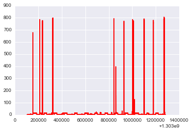
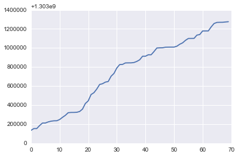
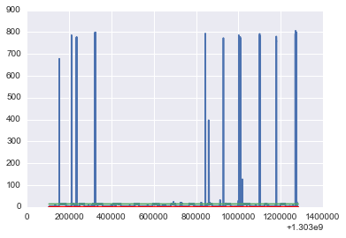
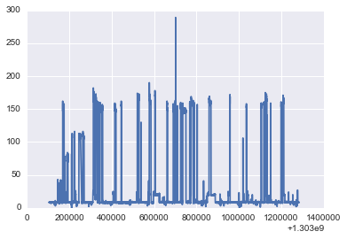
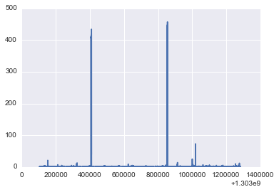
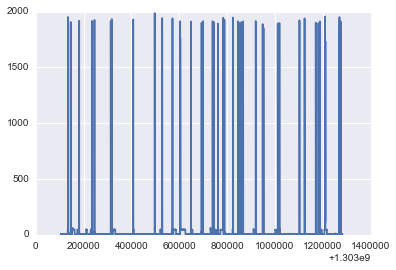
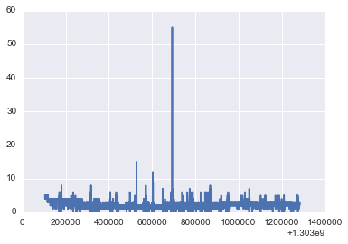
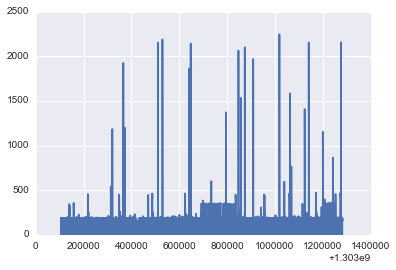
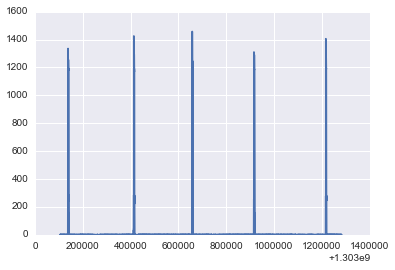
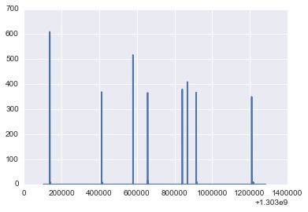

Demo IPython notebook
=====================

.. code:: python

    from scipy.cluster.vq import kmeans,vq
    NUMBER_OF_CHANNELS=11
    import seaborn as sns
    % pylab inline

.. parsed-literal::

    Populating the interactive namespace from numpy and matplotlib

Computing stats for Kitchen\_Outlets Channel 3
----------------------------------------------

.. code:: python

    data=loadtxt('/home/nipun/study/datasets/MIT/low_freq/house_2/channel_3.dat')
    power=zeros(shape=(NUMBER_OF_CHANNELS,len(data[:,0])-10000))
    power.shape

.. parsed-literal::

    (11, 308759)

.. code:: python

    timestamp,power[2]=data[:,0][:-10000],data[:,1][:-10000]
.. code:: python

    #figsize(20,10)
    plot(timestamp,power[2],'r');

.. code:: python

    NUMBER_OF_CLUSTERS=zeros(11,dtype=int)

.. code:: python

    NUMBER_OF_CLUSTERS[2]=3
    print NUMBER_OF_CLUSTERS,NUMBER_OF_CLUSTERS[2]
    
    centroids,_ = kmeans(power[2],NUMBER_OF_CLUSTERS[2])
    idx,_ = vq(power[2],centroids)
    print "Contribution of different states"
    for i in range(0,NUMBER_OF_CLUSTERS[2]):
        print "Power: ",centroids[i], "Percent: ",100.0*sum(idx==i)/len(idx)
    #Finding difference
    events_time=zeros(shape=(NUMBER_OF_CHANNELS,len(data[:,0])-10000-1))
    difference=diff(idx)
    print difference.shape
    print events_time[2].shape
    print timestamp.shape
    print idx[difference>0]
    c=timestamp[difference>0]
    plot(c)
    d=[]
    d.append(timestamp[:-1][difference>0])
    print d

.. parsed-literal::

    [0 0 3 0 0 0 0 0 0 0 0] 3
    Contribution of different states
    Power:  13.6580891636 Percent:  29.5615674361
    Power:  0.29533458827 Percent:  70.1984395597
    Power:  634.162337662 Percent:  0.239993004253
    (308758,)
    (308758,)
    (308759,)
    [0 0 0 0 0 0 0 0 1 1 0 0 0 0 0 0 0 0 0 0 0 0 0 0 0 0 0 0 0 0 0 0 0 1 1 1 0
     0 0 0 0 1 1 0 0 1 0 1 1 1 1 0 0 0 0 1 1 1 0 0 1 1 1 0 0 1 1 1 1 0]
    [array([  1.30313471e+09,   1.30315299e+09,   1.30315307e+09,
             1.30318473e+09,   1.30321120e+09,   1.30321136e+09,
             1.30322302e+09,   1.30323080e+09,   1.30323474e+09,
             1.30323534e+09,   1.30324794e+09,   1.30327116e+09,
             1.30329203e+09,   1.30331993e+09,   1.30332257e+09,
             1.30332276e+09,   1.30332423e+09,   1.30333264e+09,
             1.30335754e+09,   1.30341673e+09,   1.30344394e+09,
             1.30351075e+09,   1.30353030e+09,   1.30356886e+09,
             1.30361675e+09,   1.30362448e+09,   1.30364125e+09,
             1.30364771e+09,   1.30370316e+09,   1.30373237e+09,
             1.30378954e+09,   1.30382552e+09,   1.30382743e+09,
             1.30384284e+09,   1.30384348e+09,   1.30384364e+09,
             1.30384735e+09,   1.30385892e+09,   1.30387594e+09,
             1.30391296e+09,   1.30391316e+09,   1.30392857e+09,
             1.30392873e+09,   1.30396233e+09,   1.30399978e+09,
             1.30400151e+09,   1.30400247e+09,   1.30400792e+09,
             1.30400891e+09,   1.30400931e+09,   1.30400943e+09,
             1.30401856e+09,   1.30403916e+09,   1.30405373e+09,
             1.30407997e+09,   1.30409968e+09,   1.30410008e+09,
             1.30410049e+09,   1.30413512e+09,   1.30414122e+09,
             1.30417874e+09,   1.30417914e+09,   1.30417923e+09,
             1.30422155e+09,   1.30425702e+09,   1.30426853e+09,
             1.30426961e+09,   1.30426992e+09,   1.30427329e+09,
             1.30427598e+09])]

.. code:: python

    plot(timestamp,power[2])
    plot(timestamp,centroids[0]*ones(len(timestamp)))
    plot(timestamp,centroids[1]*ones(len(timestamp)),'r');

Thus, this circuit has 3 main power states:

-  On : 14
-  High : 775
-  Off : 0

Next, we look at Lighting, which is channel Number 4

.. code:: python

    data=loadtxt('/home/nipun/study/datasets/MIT/low_freq/house_2/channel_4.dat')
.. code:: python

    power[3]=data[:,1][:-10000]
.. code:: python

    plot(timestamp,power[3]);

.. code:: python

    NUMBER_OF_CLUSTERS[3]=3
    print NUMBER_OF_CLUSTERS,NUMBER_OF_CLUSTERS[3]
    
    centroids,_ = kmeans(power[3],NUMBER_OF_CLUSTERS[3])
    idx,_ = vq(power[3],centroids)
    print "Contribution of different states"
    for i in range(0,NUMBER_OF_CLUSTERS[3]):
        print "Power: ",centroids[i], "Percent: ",100.0*sum(idx==i)/len(idx)
    

.. parsed-literal::

    [0 0 3 3 0 0 0 0 0 0 0] 3
    Contribution of different states
    Power:  149.702120727 Percent:  11.9274255973
    Power:  25.0789054629 Percent:  9.96602528185
    Power:  8.32110913456 Percent:  78.1065491208

Now analysis for Stove

.. code:: python

    data=loadtxt('/home/nipun/study/datasets/MIT/low_freq/house_2/channel_5.dat')
    power[4]=data[:,1][:-10000]
    #figsize(20,10)
    plot(timestamp,power[4]);

.. code:: python

    NUMBER_OF_CLUSTERS[4]=2
    print NUMBER_OF_CLUSTERS,NUMBER_OF_CLUSTERS[4]
    
    centroids,_ = kmeans(power[4],NUMBER_OF_CLUSTERS[4])
    idx,_ = vq(power[4],centroids)
    print "Contribution of different states"
    for i in range(0,NUMBER_OF_CLUSTERS[4]):
        print "Power: ",centroids[i], "Percent: ",100.0*sum(idx==i)/len(idx)

.. parsed-literal::

    [0 0 3 3 2 0 0 0 0 0 0] 2
    Contribution of different states
    Power:  405.950795948 Percent:  0.223799144316
    Power:  0.560103613488 Percent:  99.7762008557

Thus stove has two state:

-  0
-  405

Next we analyse microwave

.. code:: python

    data=loadtxt('/home/nipun/study/datasets/MIT/low_freq/house_2/channel_6.dat')
    power[5]=data[:,1][:-10000]
    #figsize(20,10)
    plot(timestamp,power[5]);

.. code:: python

    NUMBER_OF_CLUSTERS[5]=3
    print NUMBER_OF_CLUSTERS,NUMBER_OF_CLUSTERS[5]
    
    centroids,_ = kmeans(power[5],NUMBER_OF_CLUSTERS[5])
    idx,_ = vq(power[5],centroids)
    print "Contribution of different states"
    for i in range(0,NUMBER_OF_CLUSTERS[5]):
        print "Power: ",centroids[i], "Percent: ",100.0*sum(idx==i)/len(idx)

.. parsed-literal::

    [0 0 3 3 2 3 0 0 0 0 0] 3
    Contribution of different states
    Power:  1846.91768293 Percent:  0.318695163542
    Power:  4.48346811489 Percent:  89.9915468051
    Power:  45.9920783475 Percent:  9.68975803134

-  3
-  12
-  1340

.. code:: python

    data=loadtxt('/home/nipun/study/datasets/MIT/low_freq/house_2/channel_7.dat')
    power[6]=data[:,1][:-10000]
    #figsize(20,10)
    plot(timestamp,power[6]);

.. code:: python

    NUMBER_OF_CLUSTERS[6]=2
    print NUMBER_OF_CLUSTERS,NUMBER_OF_CLUSTERS[6]
    
    centroids,_ = kmeans(power[6],NUMBER_OF_CLUSTERS[6])
    idx,_ = vq(power[6],centroids)
    print "Mean",power[6].mean()
    print "Contribution of different states"
    for i in range(0,NUMBER_OF_CLUSTERS[6]):
        print "Power: ",centroids[i], "Percent: ",100.0*sum(idx==i)/len(idx)

.. parsed-literal::

    [0 0 3 3 2 3 2 0 0 0 0] 2
    Mean 2.16750928718
    Contribution of different states
    Power:  3.27669597508 Percent:  21.1067531635
    Power:  1.87076234657 Percent:  78.8932468365

We take it to be in only 1 state : 2W

.. code:: python

    data=loadtxt('/home/nipun/study/datasets/MIT/low_freq/house_2/channel_8.dat')
    power[7]=data[:,1][:-10000]
    #figsize(20,10)
    plot(timestamp,power[7]);

.. image:: redd_1d_clustering_files/redd_1d_clustering_26_0.png

.. code:: python

    NUMBER_OF_CLUSTERS[7]=2
    print NUMBER_OF_CLUSTERS,NUMBER_OF_CLUSTERS[7]
    
    centroids,_ = kmeans(power[7],NUMBER_OF_CLUSTERS[7])
    idx,_ = vq(power[7],centroids)
    print "Mean",power[7].mean()
    print "Contribution of different states"
    for i in range(0,NUMBER_OF_CLUSTERS[7]):
        print "Power: ",centroids[i], "Percent: ",100.0*sum(idx==i)/len(idx)

.. parsed-literal::

    [0 0 3 3 2 3 2 2 0 0 0] 2
    Mean 10.5386077815
    Contribution of different states
    Power:  1055.68759124 Percent:  0.887423524496
    Power:  1.18066525281 Percent:  99.1125764755

.. code:: python

    data=loadtxt('/home/nipun/study/datasets/MIT/low_freq/house_2/channel_9.dat')
    power[8]=data[:,1][:-10000]
    f#igsize(20,10)
    plot(timestamp,power[8]);

.. code:: python

    NUMBER_OF_CLUSTERS[8]=3
    print NUMBER_OF_CLUSTERS,NUMBER_OF_CLUSTERS[8]
    
    centroids,_ = kmeans(power[8],NUMBER_OF_CLUSTERS[8])
    idx,_ = vq(power[8],centroids)
    print "Mean",power[8].mean()
    print "Contribution of different states"
    for i in range(0,NUMBER_OF_CLUSTERS[8]):
        print "Power: ",centroids[i], "Percent: ",100.0*sum(idx==i)/len(idx)

.. parsed-literal::

    [0 0 3 3 2 3 2 2 3 0 0] 3
    Mean 79.5419080901
    Contribution of different states
    Power:  403.410734592 Percent:  1.42408804278
    Power:  163.521471144 Percent:  42.9827146739
    Power:  6.31555092077 Percent:  55.5931972833

Next Dishwasher

.. code:: python

    data=loadtxt('/home/nipun/study/datasets/MIT/low_freq/house_2/channel_10.dat')
    power[9]=data[:,1][:-10000]
    #figsize(20,10)
    plot(timestamp,power[9]);

.. code:: python

    NUMBER_OF_CLUSTERS[9]=2
    print NUMBER_OF_CLUSTERS,NUMBER_OF_CLUSTERS[9]
    
    centroids,_ = kmeans(power[9],NUMBER_OF_CLUSTERS[9])
    idx,_ = vq(power[9],centroids)
    print "Mean",power[9].mean()
    print "Contribution of different states"
    for i in range(0,NUMBER_OF_CLUSTERS[9]):
        print "Power: ",centroids[i], "Percent: ",100.0*sum(idx==i)/len(idx)

.. parsed-literal::

    [0 0 3 3 2 3 2 2 3 2 0] 2
    Mean 9.20237142885
    Contribution of different states
    Power:  1.55728893336 Percent:  99.3613141641
    Power:  1198.55933063 Percent:  0.638685835878

Next Disposal

.. code:: python

    data=loadtxt('/home/nipun/study/datasets/MIT/low_freq/house_2/channel_11.dat')
    power[10]=data[:,1][:-10000]
    #figsize(20,10)
    plot(timestamp,power[10]);

.. code:: python

    NUMBER_OF_CLUSTERS[10]=2
    print NUMBER_OF_CLUSTERS,NUMBER_OF_CLUSTERS[10]
    temp=power[10][:2000]
    centroids,_ = kmeans(temp,NUMBER_OF_CLUSTERS[10])
    idx,_ = vq(temp,centroids)
    print "Mean",temp.mean()
    print "Contribution of different states"
    for i in range(0,NUMBER_OF_CLUSTERS[10]):
        print "Power: ",centroids[i], "Percent: ",100.0*sum(idx==i)/len(idx)

.. parsed-literal::

    [0 0 3 3 2 3 2 2 3 2 2] 2
    Mean 0.0
    Contribution of different states
    Power:  0.0 Percent:  100.0
    Power: 

::

    ---------------------------------------------------------------------------
    IndexError                                Traceback (most recent call last)

    <ipython-input-25-6ecaffb3aad8> in <module>()
          7 print "Contribution of different states"
          8 for i in range(0,NUMBER_OF_CLUSTERS[10]):
    ----> 9     print "Power: ",centroids[i], "Percent: ",100.0*sum(idx==i)/len(idx)
    

    IndexError: index out of bounds

Finding the times when appliances change state. The purpose behind this
is to find out number of simultaneous switching.

.. code:: python

    import requests
    from IPython.display import HTML
    styles = requests.get("https://raw.github.com/CamDavidsonPilon/Probabilistic-Programming-and-Bayesian-Methods-for-Hackers/master/styles/custom.css")
    HTML(styles.text)

.. raw:: html

    
    

.. parsed-literal::

    

